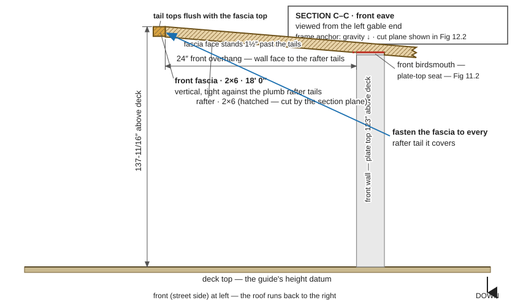

# Stage 9 — Fascia, rake boards and the roofing note

<!-- model trace: fascia 2x6 x 216 (x -15.5..200.5, 12" past each side wall); front fascia
     y -29..-27.5, z 132.1865..137.6865; back fascia y 80.5..82, z 91.6865..97.1865; tops
     flush with rafter tail tops (z 137.6865 / 97.1865). Rake boards x -15.5..-14 /
     199..200.5, y -27.5..80.5, same parallelogram as a rafter minus the seats, ends butt
     the fascia inner faces. Roofing/sheathing/fasteners: not modeled, on neither order. -->

> **Goal:** every rafter tail is capped: fascia across the front and back, rake boards down
> the two gable edges — and you know exactly what the roofing shopping list is.
> **Crew:** 2 people · **Time:** about half a day · **Weather:** dry and calm

## Before you start

Parts for this page:

| Qty | Part | Lumber | Cut length |
|---|---|---|---|
| 1 | front fascia | 2×6 KD | 18' 0" |
| 1 | back fascia | 2×6 KD | 18' 0" |
| 1 | left rake board | 2×6 KD | 9' 7⅜" |
| 1 | right rake board | 2×6 KD | 9' 7⅜" |

The fascia come off true 20' 2×6 stock — order true 20-footers and cut each to 18', not
two shorter boards scarfed together. The rake boards are the same parallelogram as a rafter
with **no birdsmouths**: if you cut one early and kept it as a spare, it already has the
right end angles.

Tools: tape, pencil, speed square, circular saw, sawhorses, two ladders, a helper, string
line.

Already built: all thirteen rafters seated, plumbed, and fastened ([Stage 8](11-rafters.md)).

## Steps

### 1. Nail up the front fascia

Two people, two ladders. Offer the 18' front fascia up against the front rafter tails,
tight to the plumb end cuts, its top edge flush with the rafter tail tops — 137-11/16"
above the deck. Centre it so it stands **12" past each side wall**, then fasten it to every
rafter tail.

> ⚠️ **WARNING** — An 18-foot board at ladder height, held overhead · drops, splits, and
> falls · lift it up between two people, rest it on the rafter tails before fastening, and
> never hold it clear of the tails with just your arms.

### 2. Nail up the back fascia

Same board, same rules, low side of the roof: tight against the back rafter tails, top
edges flush with the tail tops — 97-3/16" above the deck — and 12" past each side wall.

### 3. Fit the rake boards

Each rake board runs down a gable edge over the overhang, the same 4½-in-12 slope as the
rafters. Set the left rake board along the left roof edge with its ends butting the inner
faces of the front and back fascia, and fasten it at each end through the fascia. Fit the
right rake board the same way.

The rake boards span the overhang between the fascia with nothing under them in the model;
if a span feels springy, add your own brace blocks underneath — that is site judgement, not
modeled work.

### 4. Write the roofing shopping list

> 🛒 **SHOPPING CALLOUT — roofing is on you.** The roof's working layers are **not modeled
> and are not on either lumber order** — deliberately. Nobody has picked your roofing, so
> nobody can pick its quantities. Source, to your own roofing spec:
>
> - roof sheathing (sheet goods) — the roof is two slopes, each about 18' wide and
>   9' 7⅜" up the slope, at 4½ in 12;
> - underlayment and its fasteners;
> - the roofing material itself and its fasteners;
> - drip edge for the eaves and rakes.
>
> Plan the sheet goods and drip edge around those slope dimensions, and add this to a
> separate shopping list before the framing weather-exposure window closes.

## Before you move on

- [ ] Fascia tops flush with the rafter tail tops along the whole run — checked by sighting
      down each fascia and running a hand along the top.
- [ ] Each fascia stands 12" past the side walls at both ends — checked with a tape.
- [ ] Both rake boards butt the fascia inner faces at both ends, on the roof's slope —
      checked by sighting along each gable edge.
- [ ] Roofing shopping list written: sheathing, underlayment, roofing, drip edge,
      fasteners — checked off this page's callout.

Cut list: [R01](r01-cut-list.md) · Something not fitting: [P16](16-troubleshooting.md) ·
Next: [Stage 10 — Skirt and siding](13-skirt-and-siding.md)
